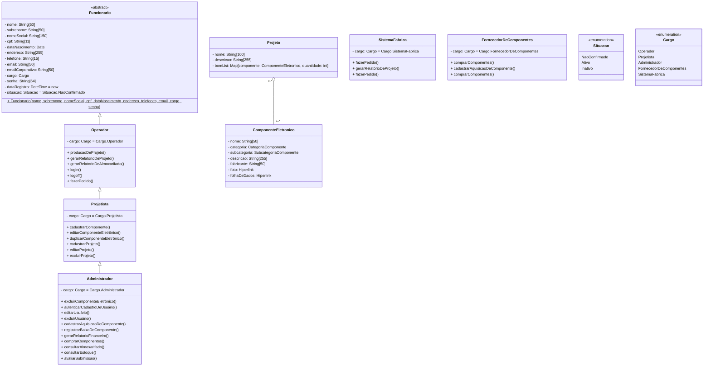

```mermaid
classDiagram
    Funcionario <|-- Operador
    Operador <|-- Projetista
    Projetista <|-- Administrador
    Projeto "0..*" o-- "1..*" ComponenteEletronico
    
    class Funcionario {
    <<abstract>>
    - nome: String[50]
    - sobrenome: String[50]
    - nomeSocial: String[150]
    - cpf: String[11]
    - dataNascimento: Date
    - endereco: String[255]
    - telefone: String[15]
    - email: String[50]
    - emailCorporativo: String[50]
    - cargo: Cargo
    - senha: String[64]
    - dataRegistro: DateTime = now
    - situacao: Situacao = Situacao.NaoConfirmado
    + Funcionario(nome, sobrenome, nomeSocial, cpf, dataNascimento, endereco, telefones, email, cargo, senha)$
    }
    
    class Operador {
    - cargo: Cargo = Cargo.Operador
    + producaoDeProjeto()
    + gerarRelatorioDeProjeto()
    + gerarRelatorioDeAlmoxarifado()
    + login()
    + logoff()
    + fazerPedido()
    }
    
    class Projetista {
    - cargo: Cargo = Cargo.Projetista
    + cadastrarComponente()
    + editarComponenteEletrônico()
    + duplicarComponenteEletrônico()
    + cadastrarProjeto()
    + editarProjeto()
    + excluirProjeto()
    }
    
    class SistemaFabrica {
    - cargo: Cargo = Cargo.SistemaFabrica
    + fazerPedido()
    + gerarRelatórioDeProjeto()
    + fazerPedido()
    }
    
    class FornecedorDeComponentes {
    - cargo: Cargo = Cargo.FornecedorDeComponentes
    + comprarComponentes()
    + cadastrarAquisicaoDeComponente()
    + comprarComponentes()
    }
    
    class Administrador {
    - cargo: Cargo = Cargo.Administrador
    + excluirComponenteEletrônico()
    + autenticarCadastroDeUsuário()
    + editarUsuário()
    + excluirUsuário()
    + cadastrarAquisicaoDeComponente()
    + regisstrarBaixaDeComponente()
    + gerarRelatorioFinanceiro()
    + comprarComponentes()
    + consultarAlmoxarifado()
    + consultarEstoque()
    + avaliarSubmissao()
    }
        
    class Situacao {
    <<enumeration>>
    NaoConfirmado
    Ativo
    Inativo    
    }
    
    class Cargo {
      <<enumeration>>
      Operador
      Projetista
      Administrador
      FornecedorDeComponentes
      SistemaFabrica
    }
    
    class ComponenteEletronico {
    - nome: String[50]
    - categoria: CategoriaComponente
    - subcategoria: SubcategoriaComponente
    - descricao: String[255]
    - fabricante: String[50]
    - foto: Hiperlink
    - folhaDeDados: Hiperlink
    }
    
    class Projeto {
    - nome: String[100]
    - descricao: String[255]
    - bomList: Map[componente: ComponenteEletronico, quantidade: int]
    }
```
