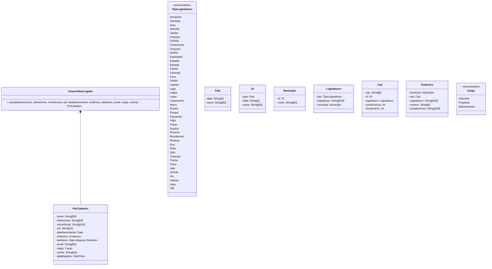

```mermaid
classDiagram
    UsuarioNaoLogado "1" *-- "1" PreCadastro
    
    class UsuarioNaoLogado {
    + precadastrar(nome, sobrenome, nomeSocial, cpf, dataNascimento, endereco, telefones, email, cargo, senha): PreCadastro
    }
    
    class PreCadastro {
    - nome: String[50]
    - sobrenome: String[50]
    - nomeSocial: String[150]
    - cpf: String[11]
    - dataNascimento: Date
    - endereco: Endereco
    - telefones: Map~etiqueta-Telefone~
    - email: String[50]
    - cargo: Cargo
    - senha: String[64]
    - dataRegistro: DateTime
    }
    
    class TipoLogradouro {
    <<enumeration>>
    Aeroporto
    Alameda
    Área
    Avenida
    Campo
    Chácara
    Colônia
    Condomínio
    Conjunto
    Distrito
    Esplanada
    Estação
    Estrada
    Favela
    Fazenda
    Feira
    Jardim
    Ladeira
    Lago
    Lagoa
    Largo
    Loteamento
    Morro
    Núcleo
    Parque
    Passarela
    Pátio
    Praça
    Quadra
    Recanto
    Residencial
    Rodovia
    Rua
    Setor
    Sítio
    Travessa
    Trecho
    Trevo
    Vale
    Vereda
    Via
    Viaduto
    Viela
    Vila
    }
    
    class Pais {
    sigla: String[3]
    %% sigla baseada no Código ISO 3166-1 Alpha-3: código de três letras que representa o nome do país. Por exemplo, BRA para Brasil, USA para Estados Unidos, JPN para Japão, etc.
    nome: String[50]
    }
    
    class Uf {
    - pais: Pais
    - sigla: String[2]
    - nome: String[50]
    }
    
    class Municipio {
    - uf: Uf
    - nome: String[50]
    }
    
    class Logradouro {
    - tipo: TipoLogradouro
    - logradouro: String[100]
    - municipio: Municipio
    }
    
    class Cep {
    - cep: String[9]
    - uf: Uf
    - logradouro: Logradouro
    - numeroInicio: int
    - NumeroFim: int
    }
    
    class Endereco {
    - municipio: Municipio
    - cep: Cep
    - Logradouro: String[100]
    - numero: String[6]
    - complemento: String[100]
    }
    
    class Cargo {
      <<enumeration>>
      Operador
      Projetista
      Administrador
    }
```
