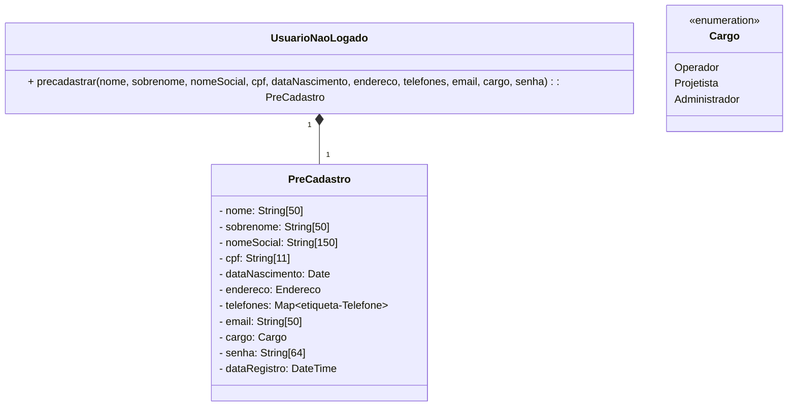

```mermaid
classDiagram
    UsuarioNaoLogado "1" *-- "1" PreCadastro
    
    class UsuarioNaoLogado {
    + precadastrar(nome, sobrenome, nomeSocial, cpf, dataNascimento, endereco, telefones, email, cargo, senha): PreCadastro
    }
    
    class PreCadastro {
    - nome: String[50]
    - sobrenome: String[50]
    - nomeSocial: String[150]
    - cpf: String[11]
    - dataNascimento: Date
    - endereco: Endereco
    - telefones: Map~etiqueta-Telefone~
    - email: String[50]
    - cargo: Cargo
    - senha: String[64]
    - dataRegistro: DateTime
    }
    
    class Cargo {
      <<enumeration>>
      Operador
      Projetista
      Administrador
    }
```
