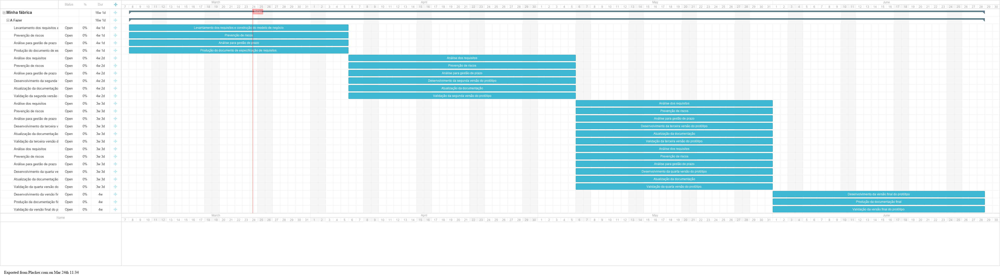

# Plano de Trabalho 01
Projeto: Minha fábrica  
Cliente: André Araújo

## Objetivos
Sistema multiusuário com becape criptografado com histórico de alterações e com suporte para log de auditoria e histórico de acesso.
Gerenciar processo produtivo de projetos eletrônicos com suporte para controle financeiro e suporte para controle fiscal.
Registro de componentes necessários para projetos, abertura de pedidos e solicitações de insumos junto a fornecedores, sem suporte para montagem virtual de circuitos.

## Motivações
Considerando a escassez de softwares mais específicos para gestão de processos de criação, produção e comercialização de projetos eletrônicos, sugerimos o desenvolvimento de uma aplicação específica que disponibiliza soluções inerentes a esse contexto.
Acreditamos atender a uma demanda existente de empresários, projetistas e consumidores em geral da área de projetos eletrônicos que se beneficiariam com uma ferramenta mais especializada para atender às necessidades deste público.

## Escopo
### Contexto

O software “Minha fábrica” será uma aplicação licenciada para empresas interessadas em organizar seu processo produtivo e comercial de projetos eletrônicos por meio de rotinas desde o cadastro dos componentes disponíveis e necessários com suas características principais, até os projetos nos quais os componentes são aplicados disponibilizando, também, opções de pesquisa e geração de relatórios diversos.

### Funções
- Login/logoff.
- Cadastrar, alterar, excluir e pesquisar usuário, componente e projeto.
- Duplicar projeto e componente.
- Importar e exportar becape.
- Rotinas de recebimento de pedidos dos clientes e compras junto a fornecedores.
- Gerar relatórios de estoque de componentes, de componentes a comprar e de componentes necessários para cada projeto (_BOM list_).

## Metodologia
Propõe-se o modelo espiral para desenvolvimento do software “Minha fábrica” por unir a natureza iterativa da prototipação aos aspectos sistemáticos e controlados do modelo cascata. Permitindo, desta forma, que os riscos sejam frequentemente avaliados e possibilitando o desenvolvimento rápido de versões cada vez mais completas do software.

## Cronograma
As atividades previstas neste plano de trabalho serão realizadas em 4 meses. Com início no dia 8 de março de 2023 e finalizando no dia 28 de junho de 2023.

### Fase 1 – Iniciação
Descrição: Levantamento de requisitos e estabelecimento das funcionalidades com o cliente.  
Produto: Documento de especificação de requisitos.

### Fase 2 – Desenvolvimento inicial
Descrição: Análise dos requisitos e desenvolvimento do primeiro protótipo; criação da documentação inicial.  
Produto: Protótipo 1

### Fase 3 – Desenvolvimento avançado
Descrição: Conclusão do desenvolvimento e revisão das funcionalidades; atualização da documentação.  
Produto: Protótipo 2

### Fase 4 – Conclusão
Descrição: Testes finais para disponibilização da versão final; elaboração da documentação final.  
Produto: Versão Final

A Tabela 1 apresenta o cronograma detalhado do desenvolvimento do projeto.

Tabela 1 - Cronograma do projeto.
| Data                    | Fase | Descrição |
| ----------------------- | ---- | --------- |
| 08/03/2023 a 11/04/2023 | 1    | - Levantamento dos requisitos e construção do modelo de negócio; - Prevenção de riscos; - Análise para gestão de prazo; - Produção do documento de especificação de requisitos. |
| 12/04/2023 a 09/05/2023 | 2    | - Análise dos requisitos; - Prevenção de riscos - Análise para gestão de prazo - Desenvolvimento da primeira versão do protótipo - Produção da documentação inicial - Validação da primeira versão do protótipo - Análise dos requisitos - Prevenção de riscos - Análise para gestão de prazo - Desenvolvimento da segunda versão do protótipo - Atualização da documentação - Validação da segunda versão do protótipo. |
| 10/05/2023 a 01/06/2023 | 3    | - Análise dos requisitos - Prevenção de riscos - Análise para gestão de prazo - Desenvolvimento da quarta versão do protótipo - Atualização da documentação - Validação da quarta versão do protótipo. |
| 02/06/2023 a 28/06/2023 | 4    | - Desenvolvimento da versão final do protótipo - Produção da documentação final - Validação da versão final do protótipo. |

## Resultados esperados
A implantação deste projeto pretende alcançar os seguintes resultados:

Conforme objetivos e motivações expressos inicialmente, busca-se disponibilizar ao público-alvo uma ferramenta capaz de lhe auxiliar satisfatoriamente em suas demandas, promovendo fidelização ao uso do software com manutenções compostas por atualizações frequentes, detalhadas e qualificadas, predicados indissociáveis de uma ferramenta de apoio a rotinas do ambiente tecnológico.

## Recursos
### Valor

Tabela 2 - Cronograma financeiro para detalhamento dos recursos.
| Rubricas                | Mês 1         | Mês 2         | Mês 3         | Mês 4         | Total (R$)    |
| ----------------------- | ------------- | ------------- | ------------- | ------------- | ------------- |
| **1. Estrutura física** | R$ 2.000,00   | R$ 2 000,00   | R$ 2.000,00   | R$ 2.000,00   | R$ 8.000,00   |
| **2. Recursos humanos** | R$ 24.000,00  | R$ 24.000,00  | R$ 24.000,00  | R$ 24.000,00  | R$ 96.000,00  | 
| **Total (R$)**          | R$ 26.000,00  | R$ 26.000,00  | R$ 26.000,00  | R$ 26.000,00  | R$ 104.000,00 |

### Equipe de planejamento e desenvolvimento
- Alencar Júnior
- Bruno Peixoto
- Pablo Busatto
- Rafael Teles
